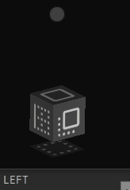

##Simple FX 3D manipulation test

use of JavaFX Box 
use of JavaFX Mesh and TriangleMesh with Transformations

The element can be used in many applications as a very nice GUI 
It needs only endpoints for model execution.

Enjoy, Mateusz